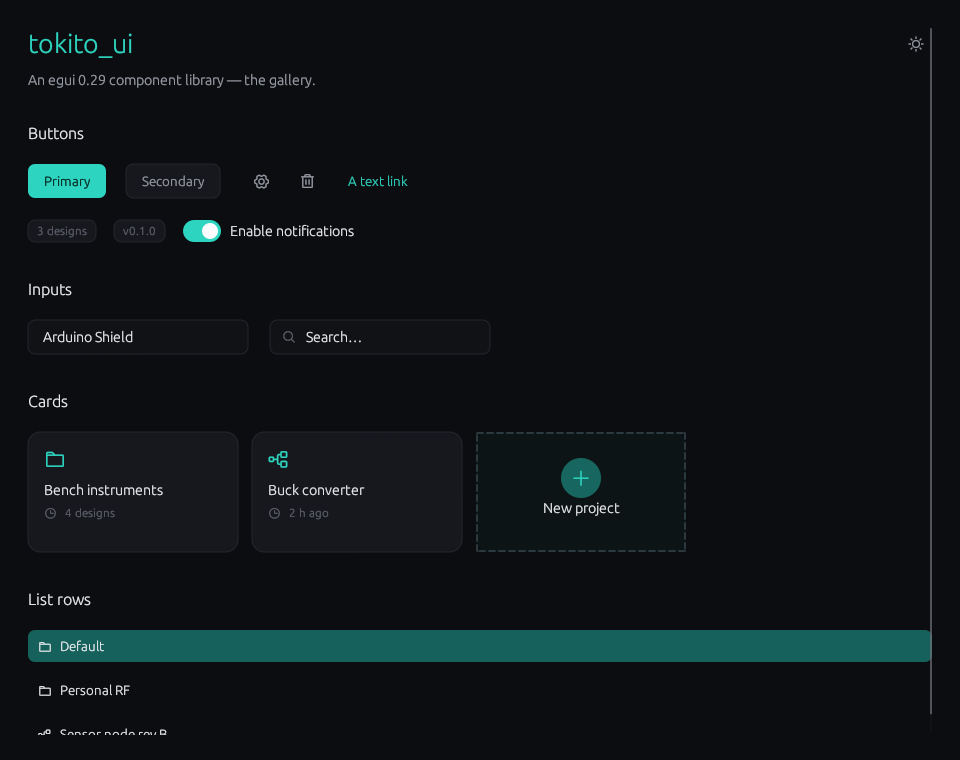
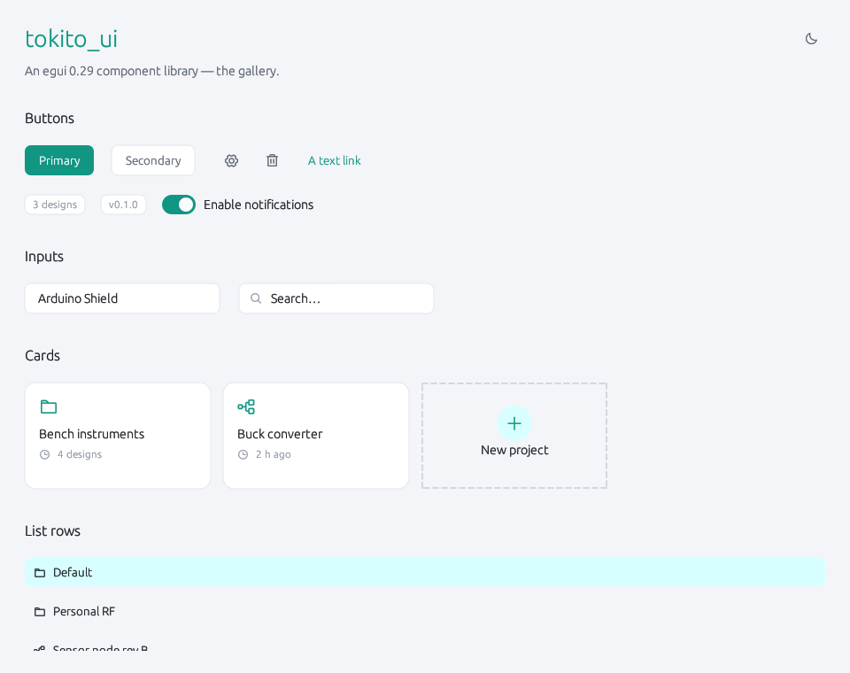

# tokito_ui — an egui component library for Rust desktop apps

**Ready-made [egui](https://github.com/emilk/egui) components — cards, modals,
buttons, inputs, menus, toggles — plus light/dark theming and Phosphor icons.
A small, opinionated UI component library and design system for Rust GUI apps.**

`tokito_ui` is an **egui 0.29 component library**: a flat colour-token palette,
a theme applier, icon helpers, and a set of composable widget primitives. It is
the shared design layer of the
[Tokito](https://github.com/VtronTokito/tokito) desktop schematic studio, and
drops into any [`egui`](https://github.com/emilk/egui) /
[`eframe`](https://github.com/emilk/egui/tree/master/crates/eframe)
application.

Think of it as a lightweight, native-Rust take on a shadcn-style component
set for egui — you own the look, the components compose.

It is not a framework. Every component is a free function; there is no global
state. Keywords: egui components, egui widgets, egui ui library, Rust GUI,
eframe, immediate-mode UI, design system, dark mode.

## Gallery

| Dark | Light |
|---|---|
|  |  |

Browse it live: `cargo run --example gallery`.

---

## Install

```toml
[dependencies]
tokito_ui = { git = "https://github.com/VtronTokito/ui" }
```

`tokito_ui` pins `egui` **0.29** and `egui-phosphor` **0.7.x**. Bump all three
together (egui-phosphor ≥ 0.8 targets egui ≥ 0.30).

## Setup — once, at startup

```rust
// 1. fonts — register your text fonts, then the icon font.
let mut fonts = egui::FontDefinitions::default();
// ... insert your proportional + monospace fonts ...
tokito_ui::theme::add_phosphor(&mut fonts);
ctx.set_fonts(fonts);

// 2. theme — apply tokens to the egui context.
let tokens = tokito_ui::Tokens::dark();   // or ::light(), or ::from_name("dark")
tokito_ui::theme::apply(ctx, &tokens);
```

`theme::apply` sets the visuals, a named type scale (`Heading`, `h2`, `h3`,
`Body`, `Small`, …) and spacing. Re-call it whenever the theme changes.

## Use

```rust
use tokito_ui::components as c;
let t = tokito_ui::Tokens::dark();

c::page_header(ui, &t, "Projects", "Open a recent project.");

let card = c::card(ui, &t, egui::vec2(300.0, 134.0), |ui| {
    ui.label("Arduino Shield v2");
});
if card.clicked() { /* open it */ }
```

---

## Tokens

`Tokens` is a flat, `Copy` struct of colours + metrics. Construct from a
preset and assign fields to customise:

```rust
let mut t = tokito_ui::Tokens::dark();
t.accent = egui::Color32::from_rgb(0xff, 0x6b, 0x35);
```

It is `#[non_exhaustive]` — new fields can be added without breaking you.
Groups: surfaces (`bg`, `bg_chrome`, `card`, `card_hover`), borders
(`border`, `border_soft`, `border_strong`), text (`text`, `text_2`, `text_3`,
`text_disabled`), accents (`accent`, `accent_ink`, `accent_soft`, `accent_2`,
`accent_2_soft`), status (`danger`, `warning`, `success`), and metrics
(`radius_*`, `space_1..5`).

## Components

All live in `tokito_ui::components` (aliased `c` above). Each takes
`ui: &mut Ui` and `t: &Tokens`.

| Component | Signature (abbreviated) | What it is |
|---|---|---|
| `card` | `card(ui, t, size, \|ui\| …) -> Response` | Animated, clickable fixed-size container. Compose domain cards from it. |
| `new_tile` | `new_tile(ui, t, label, sublabel, size) -> Response` | A dashed "create new …" tile. |
| `icon_button` | `icon_button(ui, t, glyph, side) -> Response` | A square, frameless icon button. |
| `text_button` | `text_button(ui, t, kind, label, height) -> Response` | A text button — `ButtonKind::Primary` / `Secondary`. |
| `link` | `link(ui, t, label) -> Response` | An inline accent-coloured text link. |
| `badge` | `badge(ui, t, text) -> Response` | A small bordered count / status pill. |
| `list_row` | `list_row(ui, t, job, selected) -> Response` | A full-width, left-aligned, hover-highlighted row. |
| `text_input` | `text_input(ui, t, id_source, &mut String, hint, width) -> Response` | A bordered single-line input. |
| `search_field` | `search_field(ui, t, id_source, &mut String, hint, width) -> Response` | `text_input` with a leading magnifier. |
| `toggle` | `toggle(ui, t, &mut bool, label) -> Response` | An animated switch with a trailing label. |
| `menu_button` | `menu_button(ui, t, id_source, glyph, side, \|ui\| …)` | A kebab trigger that opens a popup of `menu_item`s. |
| `menu_item` | `menu_item(ui, t, glyph, label) -> bool` | One row of a `menu_button` popup. |
| `modal` | `modal(ctx, t, &mut bool, title, width, \|ui\| …)` | A centred dialog over a dimmed backdrop. |
| `page_header` | `page_header(ui, t, title, subtitle)` | A large title over a muted subtitle. |
| `section_header` | `section_header(ui, t, title, action) -> Option<Response>` | An `h2` with an optional right-aligned action link. |
| `nav_item` | `nav_item(ui, t, label, selected) -> Response` | A sidebar nav row — solid accent fill when selected. |
| `checkbox` | `checkbox(ui, t, &mut bool, label, description) -> Response` | A square checkbox with a label and optional description line. |
| `segmented` | `segmented(ui, t, options, &mut usize, width) -> Response` | A horizontal segmented control (mutually-exclusive options). |
| `select` | `select(ui, t, id_source, current, width, \|ui\| …) -> Response` | A dropdown — trigger box + popup of `select_option`s. |
| `select_option` | `select_option(ui, t, label, selected) -> bool` | One option row inside a `select` popup. |
| `banner` | `banner(ui, t, kind, glyph, title, body) -> Response` | A status callout — `BannerKind::Success` / `Danger` / `Warning` / `Info`. |
| `collapsing` | `collapsing(ui, t, id_source, label, \|ui\| …)` | A collapsible "Advanced options" disclosure section. |

### Icons

```rust
use tokito_ui::icons;
icons::icon(icons::ph::FOLDER, 16.0, t.text_2);              // RichText
icons::icon_text(icons::ph::PLUS, 14.0, "New", 13.0, t.text); // LayoutJob
```

`icons::ph` re-exports the Phosphor Regular glyph constants. Icons render
through a dedicated font family so their codepoints never collide with a
text font.

---

## Design rules

- **No global theme.** Every component takes `&Tokens`.
- **Primitives, not finished widgets.** `card` is a container; a "project
  card" is something *you* compose.
- **Hover animates** via `egui::Context::animate_bool_with_time`.
- **Stable ids.** Anything with internal state (`text_input`, `search_field`,
  `menu_button`) takes an explicit `id_source` — never derive a widget id
  from layout position.

See `AGENTS.md` for the full contributor guide.

## Building the docs

`tokito_ui` is fully rustdoc-commented:

```sh
cargo doc --no-deps --open
```

## License

MIT.
